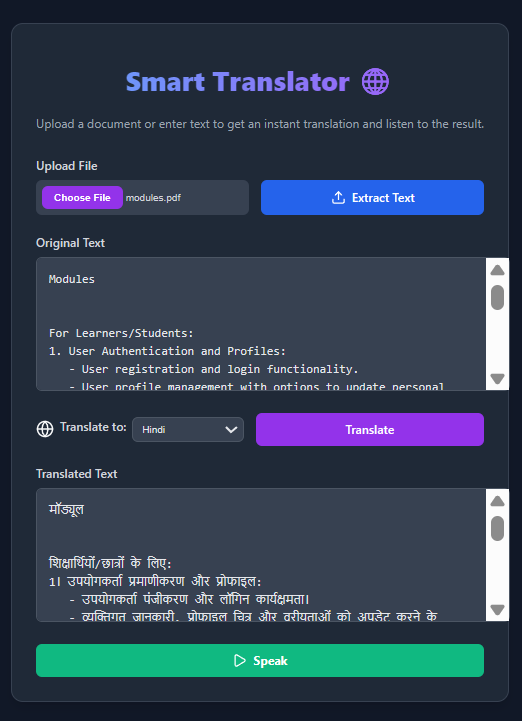

# Smart Translator
A modern, single-page translator with OCR, word tooltips, and Text‑to‑Speech. Built with React, Node.js, and Python.

## Features
- Drag‑and‑drop file upload (PDF/Image/TXT) with extract button
- OCR & text extraction via Python (EasyOCR, PyMuPDF)
- Manual text entry supported
- Translate using Google’s free endpoint (friendly/formal modes)
- Word tooltips for vocabulary (hover to see English gloss)
- Audio controls: Play, Pause, Resume, Stop + progress bar
- Download translated text and audio
- Responsive UI, side‑by‑side on desktop; stacked on mobile; language dropdown with flags

## Tech stack
- Frontend: React (Vite), Axios, lucide-react icons, custom CSS
- Backend: Node.js, Express, Multer, node-fetch, node-gtts
- Python: EasyOCR, PyMuPDF

## Prerequisites
- Node.js 18+ (or 20+)
- Python 3.x with pip

## Setup
Install dependencies and start both server and client.

```powershell
# 1) Server deps (Node)
cd server
npm ci

# 2) Python deps (OCR/PDF)
pip install -r requirements.txt

# 3) Start server (port 5000)
npm start
```

In a new terminal:

```powershell
# 4) Client deps & dev server (Vite)
cd client
npm ci
npm run dev
```

Open the client URL shown by Vite (usually http://localhost:5173).

## Usage
1. Drop a PDF/Image/TXT into the upload card (or click to browse), then click “Extract Text”.
2. Choose target language and style, then “Translate”.
3. Toggle “Word tips” to see hover tooltips for vocabulary.
4. Use Listen controls to Play/Pause/Resume/Stop; progress is shown.
5. Download Text/Audio as needed.

## Notes
- Large texts stay inside the card; panes scroll without breaking layout.
- TTS uses gTTS via the backend; the MP3 is streamed back to the client.
- OCR uses EasyOCR; for best results, upload clear, high‑contrast images.

## Folder structure
```
client/   # React app (Vite)
server/   # Express API + Python OCR/PDF helpers
docs/     # Screenshots/assets
```

## Screenshot


---
Made by Gokila
